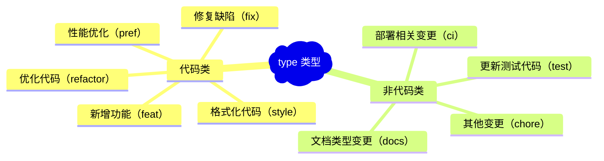

## 什么是 Commit Message

我们在做代码开发时经常需要提交代码，比如 `git commit -m 'feat: 增加登录功能'`，`-m` 后面的就是 Commit Message。用来说明提交内容。

## 规范化 Commit Message 的作用

- 清晰的知道每个 commit 的变更内容
- 基于 Commit Message 进行过滤查找
- 基于 Commit Message 生成 Change Log
- 依据某些类型的 Commit Message 触发构建流程
- 确定语义化版本的版本号

## Commit Message 的规范有哪些？

jQuery
JSHint
Ember
AngularJS-Karma
AngularJS-Angular

### Angular 规范的结构

```git
<type>[optional scope]: <description>
// 空行
[optional body]
// 空行
[optional footer(s)]
```

### Header

#### type 类型



#### scope

scope 是用来说明影响范围的，必须是名词。

#### subject

subject 是 commit 的简短描述，必须以动词开头、使用现在时。

### Body

描述具体做了哪些变更，修改动机，与上一版本相比的改动点。

### Footer

主要用来说明本次 commit 导致的后果。

#### 不兼容的改动

```
BREAKING CHANGE: <breaking change summary>
// 空行
<breaking change description + migration instructions>
// 空行
// 空行
Fixes #<issue number>
```

#### 关闭 Issue

```
 Change pause version value to a constant for image
    
    Closes #1137
```