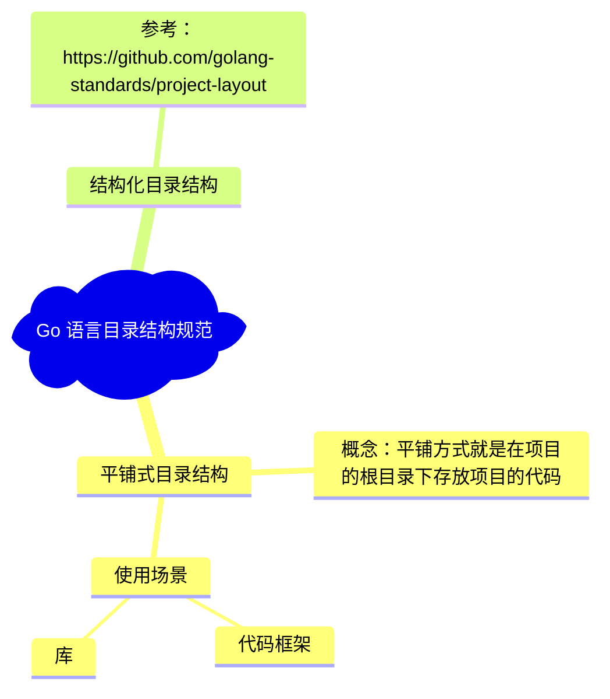

```mermaid
mindmap
  root)Go 语言目录结构规范(
    平铺式目录结构
        概念：平铺方式就是在项目的根目录下存放项目的代码
        使用场景
            代码框架
            库
    结构化目录结构
        参考：https://github.com/golang-standards/project-layout
```
