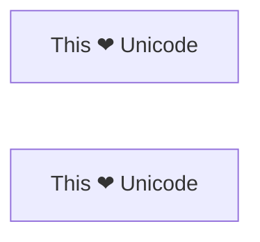

`Go` 语言的设计包含了诸多安全策略，限制了可能导致程序运行出现错误的用法。编译时类型检查可以发现大多数类型不匹配的操作，例如两个字符串做减法的错误。字符串、`map`、`slice` 和 `chan` 等所有的内置类型，都有严格的类型转化规则。

对于无法静态检测到的错误，例如数组访问越界或使用空指针，运行时动态检测可以保证程序在遇到问题的时候立即终止并打印相关的错误信息。自动内存管理（垃圾自动回收）可以消除大部分野指针和内存泄露相关的问题。

`Go` 语言的实现刻意隐藏了很多底层细节。我们无法知道一个结构体真实的内存布局，也无法无法获取一个运行时函数对应的机器码，也无法知道当前 `goruntine` 是运行在哪个操作系统的线程之上。事实上 `Go` 语言的调度器会自己决定是否需要将某个 `goruntine` 从一个操作系统线程转移到另一个操作系统线程。一个指向变量的指针也并没有展示变量的真实地址。因为垃圾回收器可能会根据需要移动变量的内存位置，当然变量对应的地址也会被自动更新。

总的来说，`Go` 语言的这些特性使得 `Go` 程序相比较低级的 `C` 语言来说更容易预测和理解，程序也不容易崩溃。通过隐藏底层的实现细节，使得 `Go` 语言编写的程序具有高度的可移植性，因为语言的语义在很大程度上是独立于任何编译器实现、操作系统和 CPU 系统结构的（当然也不是完全绝对独立：例如 `int` 等类型就依赖于 CPU 机器字的大小，某些表达式求值的具体顺序，还有编译器实现的一些额外的限制等）。

有时候我们可能会放弃使用部分语言特性而优先选择更好性能的方法，例如需要与其他编程语言写的库互操作，或者用纯 `Go` 语言无法实现的某些函数。

在本章，我们将展示如何使用 `unsafe` 包来拜托 `Go` 语言规则带来的限制，讲述如何创建 `C` 语言函数库的绑定，以及如何进行系统调用。

本章提供的方法不应该轻易使用。如果没有处理好细节，它们可能导致各种不可预测的并且隐晦的错误，甚至连有经验的 `C` 语言程序员也无法理解这些错误。使用 `unsafe` 包的同时也放弃了 `Go` 语言保证与未来版本的兼容性的承诺，因为它必然会在有意无意中使用很多实现的细节，而这些实现的细节在未来的 `Go` 语言中很可能会被改变。

要注意的是，`unsafe` 包是一个采用特殊方式实现的包。虽然它可以和普通包一样的导入和使用，但它实际上是由编译器实现的。它提供了一些访问语言内部特性的方法，特别是内存布局相关的细节。将这些特性封装到一个独立的包中，是为在极少数情况下需要使用的时候，同时引起人们的注意。此外，有一些环境因为安全因素可能限制这个包的使用。

不过 `unsafe` 包被广泛的应用与比较低级的包，例如 `runtime`、`os`、`syscall`还有`net`包等，因为他们需要和操作系统密切配合，但是对于普通程序一般是不需要使用 `unsafe` 包的。

### 13.1 unsafe.Sizeof、Alignof 和 Offsetof

unsafe.Sizeof 返回操作数在内存中的字节大小，参数可以是任意类型的表达式，但是它并不会对表达式进行求值。一个 `Sizeof` 函数调用是一个对应 `uintptr` 类型的常量表达式，因此返回的结果可以用作数组类型的长度大小或者用作计算其他常量。

```go
import unsafe

fmt.Println(unsafe.Sizeof(uint64(0))) // 8
```

`Sizeof` 函数返回的大小只包括数据结构中固定的部分，例如字符串对应结构体中指针和字符串长度部分， 但是并不包含指针指向的字符串的内容。`Go` 语言中非聚合类型通常有一个固定的大小，尽管在不同的工具链下生成的实际大小可能会有所不同。考虑到可移植性，引用类型或者包含引用类型的大小在 32 位平台上是 4 字节，在 64 位平台上是 8字节。

计算机在加载和保存数据时，如果内存地址合理的对齐将会更有效率。例如 2 字节大小的 `int16` 类型的变量地址应该是偶数，一个四字节大小的 `rune` 类型变量的地址应该是 4的倍数，一个 8 字节大小的 `float64` 、`uint64` 或者 64-bit 指针类型变量的地址应该是 8 字节对齐的。但是对于再大的地址对齐倍数则是不需要的，即使是 `complex128` 等较大的数据类型最多也是 8 字节对齐的。

由于地址对齐这个因素，一个聚合类型（结构体或数组）的大小至少是所有字段或元素大小的总和，或者更大因为可能存在内存空洞。内存空洞是编译器自动添加的没有被使用的内存空间，用于保证后面每个字段或元素的地址相对于结构或数组的开始地址能够合理对齐。

|类型|大小|
|----|----|
|bool|1个字节|
|intN,uintN,floatN,complexN|N/8个字节|
|int、uint、uintptr|1个机器字|
|*T|1个机器字|
|string| 2 个机器字（data、len）|
|[]T|三个机器字（data、len、cap）|
|map|1个机器字|
|func|1个机器字|
|chan|1个机器字|
|interface|2个机器字(type、value)|

`Go` 语言的规范并没有要求一个字段的声明顺序和内存中的顺序是一致的，所以一个编译器可以随意地重新排列每个字段的内存位置，虽然在写作本书的时候编译器还没有这么做。下面三个结构体虽然有着相同的字段，但是第一种写法比另外两个需要多 50 %的内存。

```go
struct {bool; float 64; int16} // 3 words 4 words
struct {float 64; int16, bool} // 2 words 3 words
struct {bool; int 16; float64} // 2 words 3 words
```

关于内存地址算法的细节超出了本书的范畴，也不是每一个结构体都需要担心这个问题，不过有效的包装可以使得数据结构更加紧凑。内存使用率和性能都可能会受益。

`unsafe.Alignof` 函数返回对应参数的类型需要对齐的倍数。和 `Sizeof` 类似，`Alignof` 也是返回一个常量表达式，对应一个常量。通常情况下布尔和数字类型需要对齐到他们本身的大小。其他类型对齐到机器字的大小。

`unsafe.Offsetof` 函数的参数必须是一个字段 `x.f`，然后返回字段 `f` 相对于 `x` 起始地址的偏移量，包括可能的，空洞。

图 13.1 显示了一个结构体变量 `x` 以及在其 32 位机器和 64 位机器上的典型的内存，灰色区域是空洞。

```go

var x struct {
    a bool
    b int16
    c []int
}
```

下面显示了对 `x` 和它的三个字段调用 `unsafe` 包相关函数的计算结果：



```go
var x struct {
	a bool
	b int16
	c []int
}

func main() {
	fmt.Println(unsafe.Sizeof(x), unsafe.Alignof(x))     //32 8
	fmt.Println(unsafe.Sizeof(x.a), unsafe.Alignof(x.a)) // 1 1
	fmt.Println(unsafe.Sizeof(x.b), unsafe.Alignof(x.b)) // 2 2
	fmt.Println(unsafe.Sizeof(x.c), unsafe.Alignof(x.c)) // 24 8
}

```

虽然这几个函数在不安全的 `unsafe` 包，但是这几个函数的调用并不是真的不安全，特别是需要再优化内存空间时他们返回的结果对于理解原生的内存布局很有帮助。

## 13.2 unsafe.Pointer

大多数指针会写成 `*T`，表示一个“指向 T 类型变量的指针”。`unsafe.Pointer` 是特别定义的一种指针类型。它可以包含任意类型变量的地址。当然我们不可以通过 `*p` 来获取 `unsafe.Pointer` 指针指向真实变量的值，因为我们并不知道变量的具体类型。和普通指针一样 `unsafe.Pointer` 指针也是可以比较的，并且支持和 nil 常量比较判断是否为空指针。

一个普通的 `*T` 类型可以被转化为 `unsafe.Pointer` 类型指针，并且一个 `unsafe.Pointer` 指针也可以被转回普通类型指针，被转回的普通指针类型并不需要和原始的 `*T` 类型相同。通过将 `*float64` 类型指针转化为 `*uint64` 类型指针，我们可以查看一个浮点数变量的位模式。

```go
func Float64bits(f float64) uint64 {
	return *(*uint64)(unsafe.Pointer(&f))
}
func main() {
	fmt.Printf("%#016x\n", Float64bits(1.0)) // 0x3ff0000000000000
}
```

通过转为新类型指针，我们可以更新浮点数的位模式。通过位模式操作浮点数是可以的，但更重要的意义是指针转换语法可以让我们在不破坏类型系统的前提下向内存写入任意的值。

一个 `unsafe.Pointer` 也可以被转化为 `uintptr` 类型，然后保存到指针型数值变量中，然后用以做必要的指针数值运算。这种转换虽然是可逆的，但是由`uintptr` 转换为 `unsafe.Pointer` 可能会破坏类型系统，因为并不是所有的数字都是有效的内存地址。

许多将  `unsafe.Pointer` 转为原生数字，然后再转回 `unsafe.Pointer`类型指针的操作也是不安全的。比如下面这个例子需要将变量 `x` 的地址加上 `b`字段地址偏移量转化为 `*int16` 类型指针，然后通过该指针更新 `x.b`

```go
var x struct {
	a bool
	b int16
	c []int
}

func main() {
	pb := (*int16)(unsafe.Pointer(uintptr(unsafe.Pointer(&x)) + unsafe.Offsetof(x.b)))
	fmt.Println(x.b) //0
	*pb = 42
	fmt.Println(x.b) //42
}
```

上面的写法尽管很繁琐，但在这里并不是一件坏事，因为这些功能应该很谨慎的使用。不要试图引入一个 `uintptr` 类型的临时变量，因为它可能会破坏代码的安全性，下面这段代码是错误的。

```go
	tmp := uintptr(unsafe.Pointer(&x)) + unsafe.Offsetof(x.b)
	pb := (*int16)(unsafe.Pointer(tmp))
	*pb = 42
	fmt.Println(x.b) //42
```

产生错误的原因很微妙。有时候垃圾回收器会移动一些变量以降低内存泄漏的问题。这些垃圾回收器被称为移动GC。当一个变量被移动，所有的保存该变量旧地址的指针必须同时被更新为变量移动后的新地址。从垃圾收集器的视角来看，一个 `unsafe.Pointer` 是一个指向变量的指针，因此当变量被移动时对应的指针也必须被更新，但是 `uintptr` 类型的临时变量只是一个普通的数字，所以其值不应该被改变。上面错误的代码引入一个非指针变量的临时变量 `tmp`，导致垃圾收集器无法正确识别这个是一个指向变量 `x` 的指针。当第二个语句执行时，变量 x 可能已经被转移，这时候临时变量 `tmp` 也就不再是现在的 `&x.b`地址。第三个向之前无效地址空间的赋值语句将彻底摧毁整个程序。

还有很多类似原因导致的错误。例如这条语句：

```go
pT := uintptr(unsafe.Pointer(new(T)))
```

这里并没有指针引用 `new` 新创建的变量，因此该语句执行完成之后，垃圾回收器有权马上回收其内存空间，所以返回的 `pT` 将是无效的地址。

虽然目前的 `Go` 语言还没有使用移动 GC，但这不该是编写错误代码侥幸的理由：当前的 `Go` 语言实现已经有移动变量的场景。在 5.2 节我们提到 `goruntine` 的栈是根据需要动态增长的。当发送栈动态增长的时候，原来栈中的所有变量可能需要被移动到新的更大的栈中，所以我们并不能确保变量的地址在整个使用周期内是不变的。

在编写本文时，还没有清晰的原则来指引 `Go` 程序员，什么样的 `unsafe.Pointer` 和 `uintptr` 的转换是不安全 的(参考 Issue7192 ). 译注: 该问题已经关闭)，因此我们强烈建议按照最坏的方式处理。将所有包 含变量地址的 `uintptr` 类型变量当作 BUG 处理，同时减少不必要的 `unsafe.Pointer` 类型到 `uintptr`类型的转换。在第一个例子中，有三个转换——字段偏移量到 `uintptr` 的转换和转回 `unsafe.Pointer` 类型的操作 ——所有的转换全在一个表达式完成。

当调用一个库函数，并且返回的是 `uintptr` 类型地址的时，比如下面反射包中的相关函数，返回的结果应该立刻转化为 `unsafe.Pointer` 以确保指针指向的是相同的变量。

```go
package reflect
 func (Value) Pointer() uintptr
 func (Value) UnsafeAddr() uintptr
 func (Value) InterfaceData() [2]uintptr // (index 1)
```

## 13.3 示例：深度相等判断

来自 `reflect` 包的 `DeepEqual` 函数可以对两个值进行深度相等判断。`DeepEqual` 函数使用内建的 `==` 比较操作符对基础类型进行相等判断，对于复合类型则递归该变量的每个基础类型然后做类似的比较判断，因为它可以工作在任意的类型上，甚至对一些不支持 `==` 操作运算符的类型也可以工作，因此在一些测试的代码中广泛的使用该函数。比如下面的代码是用`DeepEqual` 函数比较两个字符串数组是否相等。

```go
func TestSplit(t *testing.T) {
	got := strings.Split("a:b:c", ":")
	want := []string{"a", "b", "c"}
	if !reflect.DeepEqual(got, want) {
		t.Error("got", got, "want", want)
	}
}
```

尽管 `DeepEqual` 函数很方便，而且可以支持任意的数据类型，但是它也有不足之处。例如，它将一个 `nil` 值的 `map` 和非 `nil` 值但是空的 `map` 视作不相等，同样 `nil` 值的 `slice` 和非`nil`但是空的`slice`也视作不相等。

```go
	var a, b []string = nil, []string{}
	fmt.Println(reflect.DeepEqual(a, b)) // "false"
	var c, d map[string]int = nil, make(map[string]int)
	fmt.Println(reflect.DeepEqual(c, d)) // "false"
```

我们希望在这里实现一个自己的 Equal `函数`，用于比较类型的值。和 `DeepEqual` 函数类似的地方是它也是基于 `slice` 和 `map` 的每个元素进行递归比较，不同之处是它将 `nil` 值的 `slice`(map 类似) 和非 `nil` 值但是空的 `slice` 视作相等的值。基础部分的比较可以基于 `reflect` 包完成，和 12.3 章的 `Display` 函数的实现方法类似。同样我们也定义了一个内部函数 `equal`, 用于内部的递归比较。读者目前不用关心 seen 参数的具体含义。对于每一对需要比较的 `x` 和 `y` ，`equal` 首先检测他们是否都有效或者都无效，然后检测他们是否是相同的类型。剩下的部分是一个巨大的 `switch` 分支，用于相同基础类型的元素比较。

```go

func equal(x, y reflect.Value, seen map[comparison]bool) bool {
	if !x.IsValid() || !y.IsValid() {
		return x.IsValid() == y.IsValid()
	}

	if x.Type() != y.Type() {
		return false
	}

	if x.CanAddr() && y.CanAddr() {
		xptr := unsafe.Pointer(x.UnsafeAddr())
		yptr := unsafe.Pointer(y.UnsafeAddr())
		if xptr == yptr {
			return true
		}
		c := comparison{xptr, yptr, x.Type()}
		if seen[c] {
			return true
		}
		seen[c] = true
	}

	switch x.Kind() {
	case reflect.Bool:
		return x.Bool() == y.Bool()
	case reflect.String:
		return x.String() == y.String()
	case reflect.Int, reflect.Int8, reflect.Int16, reflect.Int32, reflect.Int64:
		return x.Int() == y.Int()
	case reflect.Uint, reflect.Uint8, reflect.Uint16, reflect.Uint32, reflect.Uint64, reflect.Uintptr:
		return x.Uint() == y.Uint()
	case reflect.Float32, reflect.Float64:
		return x.Float() == y.Float()
	case reflect.Complex64, reflect.Complex128:
		return x.Complex() == y.Complex()
	case reflect.Chan, reflect.UnsafePointer:
		return x.Pointer() == y.Pointer()
	case reflect.Array, reflect.Slice:
		if x.Len() != y.Len() {
			return false
		}
		for i := 0; i < x.Len(); i++ {
			if !equal(x.Index(i), y.Index(i), seen) {
				return false
			}
		}
		return true
	case reflect.Interface:
		if x.IsNil() || y.IsNil() {
			return x.IsNil() == y.IsNil()
		}
		return equal(x.Elem(), y.Elem(), seen)
	case reflect.Pointer:
		if x.UnsafePointer() == y.UnsafePointer() {
			return true
		}
		return equal(x.Elem(), y.Elem(), seen)
	case reflect.Struct:
		for i, n := 0, x.NumField(); i < n; i++ {
			if !equal(x.Field(i), y.Field(i), seen) {
				return false
			}
		}
		return true
	case reflect.Map:
		if x.Len() != y.Len() {
			return false
		}
		if x.UnsafePointer() == y.UnsafePointer() {
			return true
		}
		iter := x.MapRange()
		for iter.Next() {
			vx := iter.Value()
			vy := y.MapIndex(iter.Key())
			if !vx.IsValid() || !vy.IsValid() || !equal(vx, vy, seen) {
				return false
			}
		}
		return true
	case reflect.Func:
		if x.IsNil() == y.IsNil() {
			return true
		}
	}

	panic("unreachable")
}
```

和前面的建议一样，我们并不公开 `feflect` 相关的接口，所以导出的函数需要再内部自己将变量转为 `reflect.Value` 类型。

```go

type comparison struct {
	x, y unsafe.Pointer
	t    reflect.Type
}

func Equal(x, y interface{}) bool {
	if x == nil || y == nil {
		return x == y
	}

	v1 := reflect.ValueOf(x)
	v2 := reflect.ValueOf(y)

	if v1.Type() != v2.Type() {
		return false
	}
	seen := make(map[comparison]bool)
	return equal(v1, v2, seen)
}
```

为了确保算法对有环数据结构也能正常退出，我们必须记录每次已经比较的变量，从而避免进入第二次的比较。`Equal` 函数分配了一组用于比较的结构体，包含每对比较对象的地址（`unsafe.Pointer` 形式保存）和类型。我们要记录类型的原因是，有些不同的变量可能对应相同的地址。例如，如果 `x` 和 `y` 都是数组类型，那么 `x` 和 `x[0]` 将对应相同的地址，`y` 和 `y[0]` 也对应相同的地址，这可以用于区分 `x` 和 `y` 之间的比较或 `x[0]` 与 `y[0]` 之间的比较是否进行过了。

这是使用 `Equal` 函数用法的例子

```go
	fmt.Println(Equal([]int{1, 2, 3}, []int{1, 2, 3})) // "true"
	fmt.Println(Equal([]string{"foo"}, []string{"bar"})) // "false"
	fmt.Println(Equal([]string(nil), []string{})) // "true"
	fmt.Println(Equal(map[string]int(nil), map[string]int{})) // "true"
```

Equal函数甚至可以处理类似12.3章中导致Display陷入陷入死循环的带有环的数据。

```go
// Circular linked lists a -> b -> a and c -> c.
 type link struct {
     value string
     tail *link
}
a, b, c := &link{value: "a"}, &link{value: "b"}, &link{value: "c"}
 a.tail, b.tail, c.tail = b, a, c
 fmt.Println(Equal(a, a)) // "true"
 fmt.Println(Equal(b, b)) // "true"
 fmt.Println(Equal(c, c)) // "true"
 fmt.Println(Equal(a, b)) // "false"
 fmt.Println(Equal(a, c)) // "false"
```