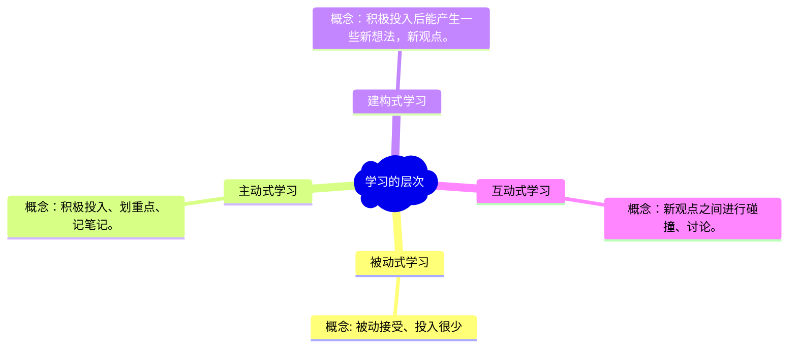

## 发刊词

### 有效学习的定义？

> 1. 你通过学习形成对各种问题的参考答案。
> 2. 你把这个参考答案应用到自己的工作和生活之中，对自己的人生产生了积极的改变。

只学习没有应用就与不学习没有什么区别，学到之后需要用起来。学习学习力本身就是一门课用该课的知识学习该课，做到学以致用。

### 什么叫学习力强？

> “听想变用” 四个方面能力都强
>
> 1. 听：听清楚，听明白。
> 2. 想：自己动脑筋去想。老师讲的好不好，如果好好在哪里？如果不好不好在哪里？
> 3. 变：你觉得某个老师讲的好，但是跟你实际情况有些距离，如何变一变把他讲的变成符合自己的需求。
> 4. 用：我们学习知识必须用到自己身上。

原来这就是四问学习法，难道学习能力强就是四问学习法用的好的人？用一个成语来概括就是学以致用。

### 学习力五项修炼

> 1. 反学习
> 2. 参考答案思维方式
> 3. 聚焦
> 4. 模式化学习
> 5. 深层迁移

学习力五项修炼是整篇课程的目录大纲。是整篇课程的核心思想。层层递进，互相关联。

## 01 | 本质：学习力强的人是什么样的？

Q：你觉得学习力强的人是什么样的？他们有哪些特征值得你学习？

A：学习力强的人学的快，用的好，能坚持学习。特征：按时学习、学习深度很深。

> 这个参考答案是：投资型学习者是学习力强的人，他们在学习上有长度、有宽度、有温度还有力度。

### 四种学习者

- 生产型学习者：把时间用来生产产品或者提供服务，在当下产生了社会价值。
- 消费型学习者：你消费了一个产品或服务，当下感到身心愉悦。
- 投资型学习者:把时间花在当下不一定产生价值，但是在将来可以持久产生价值的活动。
- 浪费型学习者：如果你既没有生产、也没有消费、也没有投资那就是浪费了。

我觉的我是一个浪费型学习者，学而不用，真的在浪费时间。

### 投资型学习者的四大特征

- 终身学习
- 全身学习
- 学以致用
- 有自己的方法论

## 02 | 方法：如何提升你的学习力？

学习力强的人的学习方法共性为五项修炼：

- 反学习：指的是把你已经学到的错误的东西给清除掉。这是一种减法式学习。
- 参考答案思维方式：就是说你不管学了什么，都要把他当做参考答案，而不是标准答案。
- 聚焦：学的少 学得深
- 模式化学习：学习事物的本质，而本质是隐藏在表面之下的，不是那么容易被发现的。
- 深层迁移：就是把一种情景中学到的知识用到另一种情景之中。

## 03 | 路标：为什么成年人首先要反学习？

### 反学习的概念

低阶反学习：清除一个错误的知识点。
高阶反学习：它清除的不是一个知识点，而是一种心智模式，这种心智模式可能对很多知识点或者对你的很多行为产生影响。

> 怎么才更有利于孩子的学习，是赞扬还是批评？更利于孩子的学习的，不是赞扬也不是批评，而是反馈。这不仅对孩子适用，对成年人也适用。批评和赞扬对你的学习都没有多大帮助。对你的学习有实质性帮助的，是反馈。这是学习科学家得出的结论。

>批评是说你做的不好，赞扬是说你做的好，而反馈的核心是告诉你下一步该怎么做。不管你现在做的好还是不好，反馈让你知道怎么做可以做的更好，所以反馈对学习更有效。

### 10 个学习上的坏习惯
1. 标准答案思维方式，总是在寻找标准答案而不是在探索自己的答案。
2. 学习方式是被动式学习。
3. 在学习上害怕出错，认为出错时学的不好的表现。
4. 在学习上追求全面发展，弥补短板，而不是围绕自己的擅长学习。
5. 缺乏对学习的规划，不擅长管理自己的学习。
6. 习惯了一个人学习，很少跟其他人进行讨论式的学习。
7. 期待老师或专家提供答案，而不是把老师或专家作为对话的伙伴。
8. 主要是在碎片化学习，虽然读了一些书，听了一些课，但是没有能够在书与书之间、课与课之间建立联系。
9. 学而不用，好像学了很多知识但是生活还是老样子。
10. 注重结果而非过程。

## 04 | 核心：为什么重要的问题没有标准答案？

### 什么是标准答案思维方式？

第一：认为所有问题都有标准答案。
第二：认为权威掌握了标准答案。
第三：认为学习的方法就是让掌握了标准答案的人告诉你。

### 世界上有三种问题

1. 有标准答案的问题。比如中国的首都是哪里？
2. 属于个人偏好问题。比如红烧肉好不好吃？
3. 那些重要的社会和个人问题。比如怎么样才能搞定一个大客户？

第二种和第三种都没有唯一正确的答案。但是第二种问题的答案无所谓对错也无所谓好坏；而第三种问题的答案尽管没有对错之分，但是有好坏之分。

要准确识别这三类问题，”不要把那些重要的社会和个人问题，当做简单的个人偏好问题来回答；不要把重要的社会和个人问题当做没有标准答案的问题来回答“。

### 擅长学习的民族

犹太人：第一：对真实的提问，第二：对权威的挑战。

### 带着怀疑学习

带着怀疑学习培养起参考答案思维方式。

带着怀疑学习是会学习的人的共同特征。

## 05 | 方法：如何用加法做减法

### 全面发展，弥补短板

> 建立聚焦新习惯。不要追求全面发展，而是聚焦在学习少数知识上。

不要求全面发展，要在自己擅长的方向做到专家。

### 碎片化学习

> 建立模式化学习新习惯。不是学习一个个碎片，而是学习深层知识，也就是模式。

学习一个一个知识点很难形成自己的理论体系，所以也不太好应用。

### 学而不用

> 建立深层迁移新习惯。深层迁移就是对模式进行迁移，这样可以把知识运用到大不相同的情景之中。

学习过程中要多问自己对我有什么用

## 06 | 路标：如何建立参考答案思维方式？

### 什么是参考答案思维方式？

学习的对象是参考答案，学习的方法是比较不同的参考答案，学习的目标是掌握优秀的参考答案，并且建构自己的参考答案。

### 如何建立参考大难思维方式？

- 一句口诀：看情况（嘴上多说"看情况"，脑子里多想“看情况”）。
- 两句追问：为什么、怎么做。

### 真理论是看情况的

符合论：认为与事实符合就是真理
融惯论：能举出证据说出理由就是真理
实用论：检验真理的唯一标准就是能否让我们更好的行动。

采用融惯论知道下的实用论，能让自己的人生过得更好。

## 07 | 理论之钟：什么样的理论才算实用？

### 好理论的三个标准

- 一般性
- 准确性
- 简单性

### 理论之钟

卡尔维克把好理论的三个标准画在了一个钟面上，12 点钟（一般性）、 4 点钟（准确性）、8 点钟（简单性）
```

```

十点钟理论具有一般性和简单性，但是不太准确

我需要怎么做？
1. 学一些 10 点钟理论。
2. 学习 10 点钟理论要注意到他的缺点。

10 点钟理论：
管理者三大能力模型（技术能力、概念能力、人际能力）。

## 08 | 策略一：为什么学会分类是关键？

### 看情况的关键是分类

所谓分类，就是把事物分成不同的类别，其实就是分成不同的情况，然后根据不同的情况，进行相应的处理。所以说，看情况的一个主要方法，就是分类。

想法：看情况就是不能一概而论，要具体问题具体分析，对情况进行归类有助于提高问题的找到解决问题的经验。找到套路，找到学习参考答案的方向。

### 洞见分类

比常见分类更高级，也更有效的分类方式，叫做“洞见分类”，洞见分类往往抓住了事物的本质。

洞见分类的三个特征：主观性、理想性、本质的。

洞见分类不仅仅在解决问题的时候可以直接用，用来吸收其他知识也很重要。

团队的一个常见的洞见分类：棒球队、橄榄球队、篮球队。

练习建立洞见分类

对于得到用户分类：
学习者分类：投资型学习者、生产型学习者、消费型学习者、浪费性学习者。
按学习方法分类：标准答案思维方式学习者、参考答案思维方式学习者。
按会不会学习：会学习的（掌握学习方法论）、不会学习的（学完和没学没什么区别的）

## 09 | 策略二：怎样找到好的参考答案？

标准参考答案：它是要找到一个在绝大多数情况下，更准确、更管用的参考答案，并且把这一答案作为"默认设置"来使用，所以把它叫作"标准参考答案"。

### 案例一：三步回答一切问题
第一步：说这个问题需要看情况
第二步：说出自己的洞见分类及每种情况的解决方案
第三步：分析具体的情况，参考哪一类分类的答案，并针对具体问题思考新的解决方案。

### 如何让婚姻幸福

- 寻找关于另一半行为的最善意的解释，并且相信它。
- 对另一半的赞扬和批评的比例不要低于 5：1。
- 尽可能让做爱的次数多于吵架的次数。

### 如何回答二选一问题

- 不要二选一，该怎么做？一个具体做法就是看情况，界定不同的情况，在某些情况下选其中一个，在另外一些情况下选另一个。
- 两个都要，两个选项没有对立性，可以同时存在。

### 两个关于标准参考答案的建议

- 对于一些重要的问题，你要掌握一些标准参考答案。
- 掌握标准参考答案之后，要牢记这不是标准答案，只是参考答案。

## 10 | 策略三：互动式学习为什么重要？

### 季清华学习层次模型


### 互动式学习的本质

互动式学习的本质不是在两个人之间进行互动，而是在不同的参考答案之间进行互动。

### 方法论一：守破离

- 守：守卫自己的观点。
- 破：攻破别人的观点。
- 离：离开前面两个观点，提出一个新的、更好的观点。

### 方法论二：事前建构

事前建构，你要真正的独立思考，开动脑筋；而事后建构，你多多少少会受到别人观点的影响。

### 方法论三：单人互动

事前建构+守破离

提前建立自己的参考答案，和其他人的参考答案进行互动

## 11 | 策略四： “反过来想” 三大招式是什么？

### 对立式

末位淘汰<->首位淘汰

### 互补式

如何赚钱 <-> 如何不赔钱

### 因果式

公司小所以才要发展技术能力 <-> 因为忙于发展技术能力所以公司才迟迟没能发展壮大。

## 12 | 策略五：如何注重过程，而不是结果？

注重过程，就是把结果当作可能性之一，重点学习得出答案的过程，看是不是可以通过同样的过程，得出不同的参考答案。

### 结果可能误导你

卡尼曼的最喜欢的一组公式

- 成功 = 能力+运气
- 巨大的成功 = 多一些能能力 + 多很多运气

### 过程是能力的核心

过程，才是一种能力的核心，才是我们真正要掌握的。

### 跟着高手学过程

- 跟着高手学过程（我不是跟着高手学知识，而是跟着高手学习他得出知识的过程）
- 重点关注不完美的过程
- 从结果还原过程（结果往往吸引了我们的注意力，我们要有意识地多问这样一个问题：这个结果是通过什么样过程得来的？或者说，这个结论是通过什么样的过程推理而来的）

## 13 | 小结：如何进行合理质疑

### 样本具有代表性吗？

举例证明一个观点是否正确的时候要思考样本是否具有代表性。举例只能说明不能论证。

### 警惕平均数

管理大师：大前言一被录用的例子，1/8 通过率


### 注意非线性

## 14 | 路标：为什么学习一定要聚焦？

### 学习的业余爱好者的通病

学习面很广，但总是浅尝辄止

掌握某种新技能、学习某门新学科，最大的动力在于急切地需要应用。基于这一原因，许多科学家（我当然也在其中）在没有感到压力时并不学习新学科和新技能，即便这些东西很容易掌握。

如果学习一个知识而没有应用场景那么很容易发生学而不用的坏习惯。

### 聚焦才能擅长

如果说卓有成效的学习有唯一秘诀的话，那就是聚焦。

1. 只有聚焦才能擅长
2. 学习=我知道+我不知道

学习就是用已有知识去建构新知识，用已有知识去吸收新知识，去跟新知识建立联系。

### 聚焦产生马太效应

你的所有学习，都是建立在你的已有知识的基础上。这一点很重要。
决定不学什么跟决定学什么同样重要

## 15 | 聚焦经典：如何聚焦不变？

### 大多数事物的本质没有变

约翰·奈斯比特 《大趋势》 很多事物变了，但大多数事物没有变
杰夫·贝佐斯 亚马逊顾客的基本需求是不变的，他们希望有更多的选择，更低的价格，更快的配送

### 认出“乔装打扮的不变”

你眼中的问题，其实是别人的解决方案。如果男朋友不理你，只顾自己打电子游戏。你认为这是个问题，对不对？实际上，这是你男朋友的解决方案。他觉得，跟你聊天太无聊了，于是用打电子游戏来解决问题。
NLP的一个核心理念就是：每一个负面行为背后，都有一个正面理由。
NLP的这个核心理念，其实也是乔装打扮的旧思想。这个旧思想，可以一直追溯到苏格拉底的一个思想，那就是：没有人会故意作恶。苏格拉底的意思是：没有人会故意做对自己没有好处的事情。

### 聚集不变的三个建议

第一个建议是：聚焦一本“向导之书”。
第二个建议是：聚焦一本“经典之书”
第三个建议是：聚焦“一本”经典之书，反复阅读。

## 16 | 小偷式学习法：如何聚焦实用

### 有用的标准：人生三大课题（工作、人际关系和个人成长）

美国哲学家理查德·罗蒂：作为成年人的标志之一就是懂得：没有任何书会向我们揭示宇宙的秘密或者生命的意义。这意味着认识到，所有这些过去的有趣的书籍都只是一个我们终将有一天有幸能摆脱掉的梯子上的一些梯级而已

教育的四大支柱：learn to know，学会求知，learn to do，学会做事，learn to live together，学会共同生活，还有learn to be，官方翻译是“学会生存”，但我觉得翻译成“学会成为自己”可能更好一些。

### 围绕工作来学习

第一个建议是：在工作、人际关系和个人成长这三大课题中，首先围绕工作来学习。

### 进行“小偷式学习”

第一个特点是，学习的对象很广泛、很发散。用一個不恰當但形象的说法，就好像流窜作案的小偷一样，不管是谁，都可能成为他下手的对象。

第二个是特点是，学习的目标很明确，只对少数东西感兴趣。哪些东西呢？就是对自己有价值的东西。小偷如果撬锁进入一所房子，他不会关心这所房子设计风格是什么样的，主人有什么兴趣爱好，他只关心一件事，就是能带走什么有价值的财物。

“小偷式学习”的第三个特点是追求学习的效率，要快速有收获。小偷必须得快，所以他只带走最容易带走、最容易变现的财物

## 17 | 大盗式学习法：如何聚焦专题

### 聚焦一个专门的问题

第一，它是一个问题，可以用提问的形式呈现出来。第二，它是一个比较具体的问题，往往有着特定的用途。第三个特点是，要回答这个问题，所需要的知识往往是跨学科、跨专业的。

聚焦专题，就是调动可以调动的各种知识，来攻克一个专门的问题。

### 聚焦专题的四大好处

1. 就是你只有聚焦一个专题，才能把这个专题变成你的擅长，变成你的核心竞争力
2. 就是你只有聚焦这个专题之后，才能掌握关于这个专题的深层结构
3. 让你有了一把“知识钥匙”，可以用来打开其他的知识宝库
4. 跟刚刚说的“知识钥匙”有点像，也是说聚焦专题可以帮助你学习其他知识。

### 聚焦专题的步骤

1. 找准你要聚焦的问题
2. 围绕你聚焦的问题，聚焦一些作者，读上 100 本书
3. 就是你在这些答案的基础上，提炼出自己的答案，形成自己的体系。
4. 应用“小偷式学习法”

## 18 | 苏东坡学习法：如何聚焦样本？

### 聚焦少数样本

在学习样本上，我们同样需要聚焦，同样需要学得少而深。

### 苏东坡式学习法

什么叫“更丰富地体验和阐释这段历史”？其实这就是苏东坡式学习法。

我先介绍苏东坡的两句诗：“旧书不厌百回读，熟读深思子自知。”苏东坡认为，一本好书里的宝物太多，也就是体现的规律很丰富，不可能一次都学到手，所以要反复读。但是这个反复读是有技巧的，就是每次只从一个角度去读。

### 一本表现整个宇宙的书

《匹克威克外传》

### 史上最短管理案例

三个石匠在打石头。一个路人经过，问你们在做什么。第一个石匠说：“我在打石头，养家糊口。”第二个石匠说：“我在做全国最好的石匠活。”第三个石匠抬起头，眼中闪过一丝光芒，说：“我在建造一座大教堂。


## 学习知识的清单

- [ ] 这对我有什么用？
- [ ] 他说的对吗？
- [ ] 能分分类吗？
- [ ] 事前建构+守破离